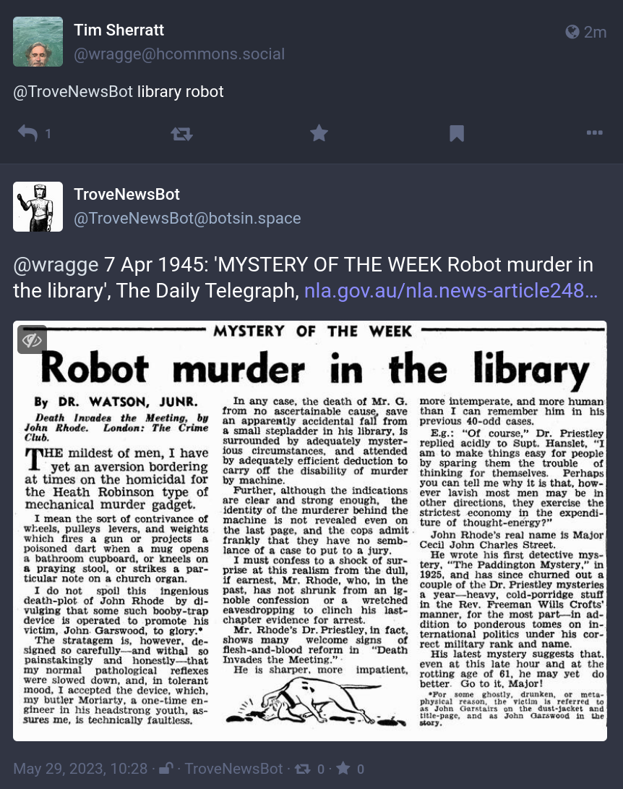

# TroveNewsBot (the Fedi edition)

[@trovenewsbot](https://wraggebots.net/@trovenewsbot) is **live** on the Fediverse.

This is the latest version of @trovenewsbot which includes a number of new or enhanced features:

* Article thumbnails with every toot!
* Search Trove without leaving Mastodon!
* Grab a nice thumbnailed version of any newspaper article!
* Serendipify your life with randomly-selected articles!
* Automatically search Trove based on the contents of any web page!



For earlier incarnations of TroveNewsBot see [this](https://github.com/wragge/trovenewsbot) and [this](https://github.com/wragge/trovenewsbot2019) repository.

## Follow via RSS

If you'd like fresh and old newspaper articles delivered daily to your RSS reader, just point it at: <https://wraggebots.net/@trovenewsbot/feed.rss>

## Search Trove newspapers

Ever wanted to search Trove's newspapers without leaving Mastodon? @trovenewsbot can help! Simply toot your search terms at @TroveNewsbot and it will search Trove for you, tooting back the most relevant result. It can be as simple as this:

```
@trovenewsbot@wraggebots.net lamingtons
```

[Here's an example](https://hcommons.social/@wragge/110449131487247668) of a tooted query and @trovenewsbot's response. Note that '@trovenewsbot' has to appear first in your toot (this is to stop the bot responding every time it gets a mention!).

### Sorting results

By default, @trovenewsbot toots back the most relevant result (as defined by Trove's relevance ranking). But you can change this by adding one of the following hashtags to your toot:

* `#luckydip` – return an article chosen at random from the results set
* `#earliest` – return the article that was published first
* `#latest` – return the article that was published last

For example:

```
@trovenewsbot@wraggebots.net lamingtons #earliest
```

### Filtering results

You can filter your results by using the following hashtags:

* `#article` – only include results in the 'Article' category
* `#advertising` – only include results in the 'Advertising' category
* `#year` – if you include this hashtag *and* a year in your toot, @trovenewsbot will limit the results to articles published in that year.
* `#illustrated` – only include articles that have illustrations
* `#onthisday` – get an article published on today's date in the past

Examples:

```
@trovenewsbot@wraggebots.net lamingtons #advertising
@trovenewsbot@wraggebots.net lamingtons 1920 #year
```

Note that if you use the `#illustrated` hashtag, @trovenewsbot will use the first illustration it finds in the selected article as the thumnail, rather than the article's headline.

### Combining search terms

If you include multiple search terms, @trovenewsbot will look for articles that contain *all* the terms (an 'AND' search). If you want to change this, you can add the following hashtag:

* `#any` – returns results that have *any* of the supplied search terms (an 'OR' search)

For example:

```
@trovenewsbot@wraggebots.net lamingtons pavlova #any
```

### Combining hashtags

You can can combine any of the hashtags described above to make more complex searches. For example:

```
@trovenewsbot@wraggebots.net lamington #earliest #illustrated
```

## Serendipity mode

But what if don't have a particular search term in mind? What if you just want to explore? @trovenewsbot can help with that as well! Simply toot `#luckydip` at @trovenewsbot for a randomly selected newspaper article. If you want slightly less random results, you can add any of the filters describe above. For example:

```
@trovenewsbot@wraggebots.net #luckydip
@trovenewsbot@wraggebots.net #luckydip #illustrated
@trovenewsbot@wraggebots.net 1910 #luckydip #illustrated #year
```

Behind the scenes, @trovenewsbot randomly selects a random option to find your random article. The options are:

* A random selection from articles that have been added or updated in the last 24 hours (that means they're new, they've been corrected, or they've had a tag or comment added)
* A random selection from *all* of Trove's newspaper articles
* A random selection from *all illustrated* newspaper articles

Note that this is something you *can't* do through the Trove web interface. Bots FTW!

## Opinionator mode

Instead of feeding search terms to @trovenewsbot, you can send it a complete web page! Just toot a url at @trovenewsbot and it will automatically extract keywords from the page and use them to search Trove. You can limit the results using the filters described above. For example:

```
@trovenewsbot@wraggebots.net https://en.wikipedia.org/wiki/Lamington
@trovenewsbot@wraggebots.net https://en.wikipedia.org/wiki/Lamington #illustrated
```

While you could add `#luckydip` to this search, you're not likely to get a very useful result. That's because @trovenewsbot searches for articles containing *any* of the keywords it extracts. Trove's relevance ranking will push articles that match mutiple keywords to the top of the results, but a random result might only match a single keyword. But hey, if you're feeling adventurous give it a go!

## Single article mode

@trovenewsbot's toots include a specially-generated thumbnail image of the newspaper article. To get these sorts of images from the Trove web interface you have to fiddle around with screen captures or PDFs. But again, @trovenewsbot can help! If you already know the article you want, just toot its identifier (that's the number in the article's url) and add the `#id` hashtag. For example, here's the url of a newspaper article in Trove:

```
https://trove.nla.gov.au/newspaper/article/162833980
```

The article identifier is `162833980`, so to get the article from @trovenewsbot, just toot:

```
@trovenewsbot@wraggebots.net 162833980 #id
```

If the article has an illustration and you'd like the illustration used as the thumbnail image rather than the headline, just add `#illustrated`:

```
@trovenewsbot@wraggebots.net 162833980 #id #illustrated
```

Here's the results [without](https://wraggebots.net/@trovenewsbot/statuses/01JEW2N2Z9AFJ14PGXBT2Y608Q) and [with](https://wraggebots.net/@trovenewsbot/statuses/01JEW2RKX4E2QSAKP87S151PZ1) the `#illustrated` hashtag. Obviously, if the article doesn't have an illustration, adding `#illustrated` will have no effect!

Once @trovenewsbot has responded with your nicely-presented article reference, you can save the thumbnail, or quote toot the result. It's an easy way of sharing a social media friendly version of a Trove newspaper article.

## Automated updates

* At 9am, 3pm and 9pm (AEST), @trovenewsbot toots a random article. Here's [an example](https://wraggebots.net/@trovenewsbot/statuses/01JETTP5EQEYHB3EHJ21KXH5PJ).
* At 8am, 12 noon, 4pm and 8pm (AEST), @trovenewsbot toots a response to the latest item on Guardian Australia's [news feed](https://www.theguardian.com/australia-news/rss) using its 'Opinionator' mode. Here's [an example](https://wraggebots.net/@trovenewsbot/statuses/01JEVRBXSD9PMYY7VHX5996DR1).

## Technical details

@trovenewsbot uses the following libraries (amongst others):

* [Mastodon.py](https://github.com/halcy/Mastodon.py/) – to interact with the Mastodon API
* [Newspaper](https://github.com/codelucas/newspaper) – to extract keywords from web pages
* [Arrow](https://arrow.readthedocs.io/en/latest/) – for easy date parsing and formatting
* [RQ](https://python-rq.org/) – to queue toots for processing

If you'd like to know more about how @trovenewsbot generates the article thumbnails, look at the examples in the [Trove Newspapers section](https://glam-workbench.net/trove-newspapers/) of the GLAM Workbench.

____

Created by [Tim Sherratt](http://timsherratt.org/).

